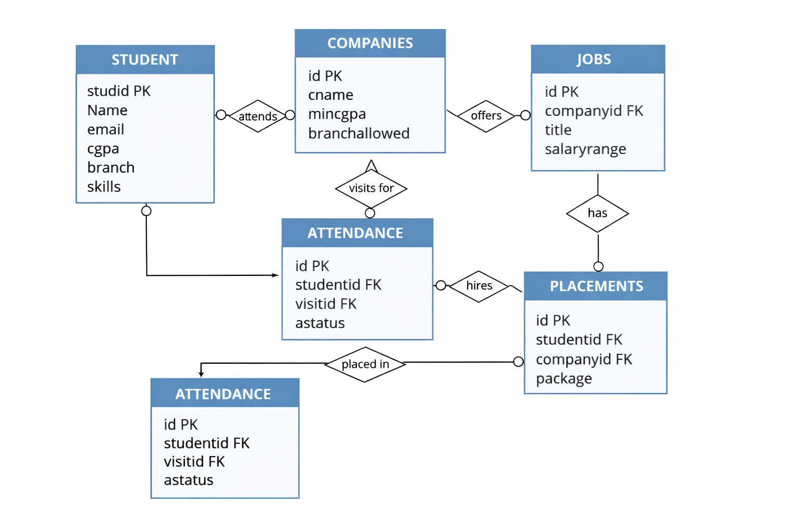
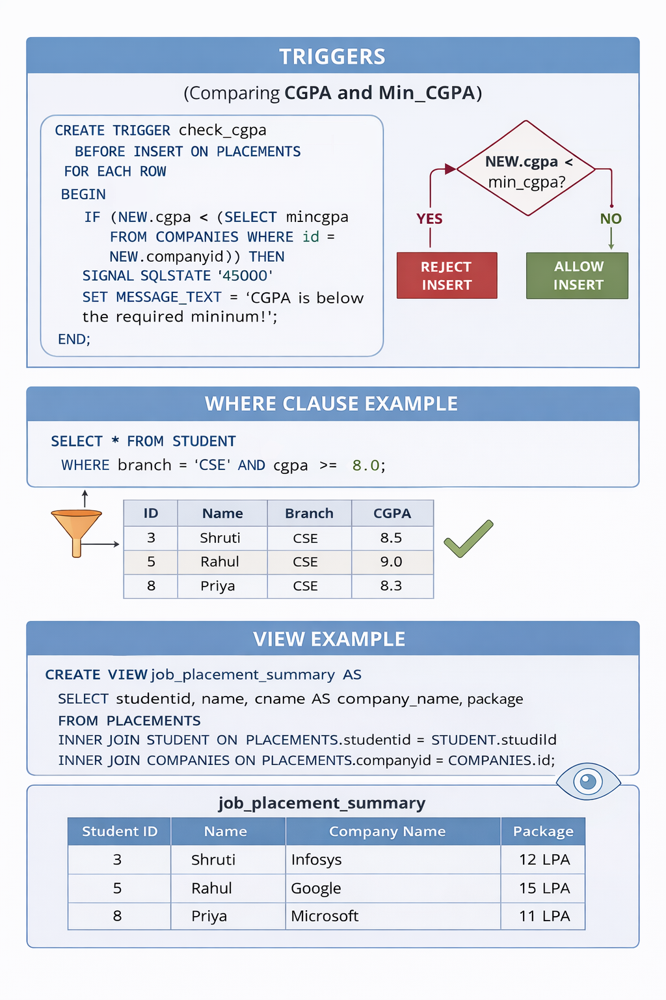
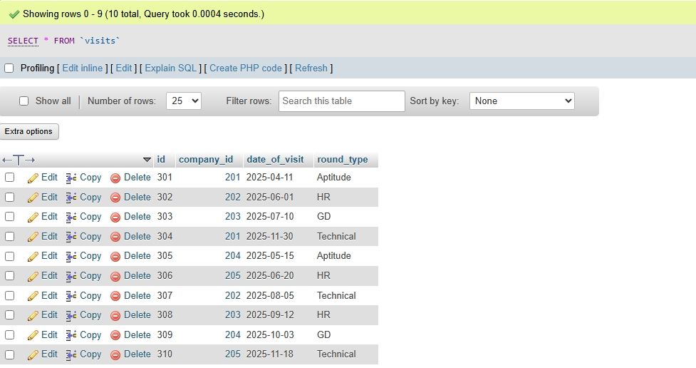
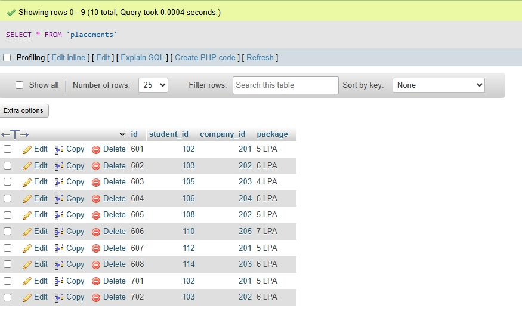

# 🎓 Placement Analysis Database — MySQL Project

> A college placement cell, modeled entirely in SQL — where eligibility isn't checked manually, it's enforced by a trigger.


## Overview

This project models the data behind a real campus placement process: students with CGPA and skills, companies with eligibility criteria, job postings, company visit schedules, interview attendance, and final placement outcomes. The centerpiece is a database **trigger** that automatically blocks a placement record from being inserted if a student's CGPA falls below a company's minimum requirement, enforcing eligibility at the data layer instead of leaving it to application code.

## Schema

| Table | Stores |
|---|---|
| `student` | Student ID, name, email, CGPA, branch, skills |
| `companies` | Company name, minimum CGPA required, branch eligibility |
| `jobs` | Job titles and salary ranges offered by each company |
| `visits` | Company visit dates and interview round type |
| `attendance` | Which students attended which visit, and their status |
| `placements` | Final placement records linking students to companies |



## Key Concepts Implemented



**CGPA eligibility trigger** — runs automatically before every insert into `placements`:

```sql
CREATE TRIGGER check_cgpa
BEFORE INSERT ON placements
FOR EACH ROW
BEGIN
  DECLARE stud_cgpa DECIMAL(8,2);
  DECLARE comp_min_cgpa DECIMAL(8,2);
  SELECT cgpa INTO stud_cgpa FROM student WHERE stud_id = NEW.student_id;
  SELECT min_cgpa INTO comp_min_cgpa FROM companies WHERE id = NEW.company_id;
  IF stud_cgpa < comp_min_cgpa THEN
    SIGNAL SQLSTATE '45000' SET MESSAGE_TEXT = 'Student CGPA not eligible';
  END IF;
END
```

Other concepts covered: foreign key constraints linking all six tables, a `student_basic` view for simplified read access, joins across students/companies/jobs/placements, `CASE`-based package categorization, and aggregate queries with `GROUP BY` and `COUNT`.

## Sample Output

| Visits table | Placements table |
|---|---|
|  |  |

## Tech Stack

MySQL / MariaDB, phpMyAdmin

## Project Structure

```
placement-analysis-mysql/
├── README.md
└── DB/
    ├── dbproject.sql                  # full schema + data (import-ready)
    ├── ERDIAGRAM.png                  # entity relationship diagram
    ├── queries_and_concepts/
    │   ├── concepts.png               # visual cheat sheet: triggers, views, WHERE
    │   └── queries.txt                # step-by-step build script with concepts
    └── screenshots/
        ├── Screenshot1.jpeg           # sample output: visits table
        └── Screenshot2.jpeg           # sample output: placements table
```

## Running it Yourself

1. Open phpMyAdmin (or any MySQL client) and create a new database
2. Import `DB/dbproject.sql` to set up all tables, the trigger, the view, and sample data
3. Run the queries in `DB/queries_and_concepts/queries.txt` step by step to see how each concept builds on the last

## Future Improvements

- Add stored procedures for common reports (e.g., placement summary by branch)
- Add indexes on foreign key columns for query performance at scale
- Add more views, such as a company-wise placement summary
- Build a lightweight front-end dashboard on top of the database

---
Built by [Ramya Sankar](https://github.com/ramyasankar22)
